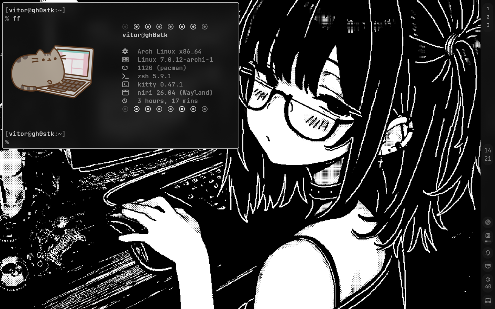

# archdots

A clean, modular, and optimized dotfiles repository for **Arch Linux**. This setup features modern Wayland compositors, custom CLI utilities, and robust installation/synchronization tooling.

---

## Screenshots

Here is the system in action:



---

## What's Included?

### Display Servers & Window Managers (Wayland)
* **Niri**: Modern scrollable-tiling window manager focused on grid layout (`config/niri/config.kdl`).

### Terminal & Shell Environment
* **Terminal Emulator**: Kitty.
* **Shell**: Zsh ([.zshrc](file:///home/vitor/archdots/.zshrc)) with robust history, optimization aliases, and local plugin setups.
* **Shell Framework**: Oh My Zsh (installed unattended).
* **Plugins**: `zsh-autosuggestions` and `zsh-syntax-highlighting` loaded automatically.

### CLI Utilities & Apps
* **File Manager**: Yazi.
* **PDF Viewer**: Sioyek.
* **Audio Visualizer**: Cava.
* **Development Runtimes**: Rustup (stable toolchain), Bun (baseline interpreter), Composer.

---

## Getting Started

> [!WARNING]
> **Do not run the installer using `sudo` or as the `root` user.**
> The installer will prompt for administrative permissions (`sudo`) only when necessary and compile AUR packages safely under your standard user.

To run the interactive installer, clone the repository and run:

```bash
cd ~/archdots
chmod +x scripts/*.sh
./scripts/install.sh
```

### Running Individual Installation Phases
You can selectively run specific parts of the setup using CLI flags:

* **Official Packages (Pacman)**:
  ```bash
  ./scripts/install.sh --pacman   # or -p
  ```
* **AUR Packages (Paru)**:
  ```bash
  ./scripts/install.sh --aur      # or -a
  ```
* **Custom Runtimes & Flatpaks**:
  ```bash
  ./scripts/install.sh --custom   # or -c
  ```
* **Silent Mode (Non-interactive)**:
  ```bash
  ./scripts/install.sh --yes      # or -y
  ```
* **Dry Run (Simulation)**:
  ```bash
  ./scripts/install.sh --dry-run  # or -d
  ```

---

## Configuration Management & Sync

You can manage your configuration files in two ways:

### Method 1: Symbolic Links (Symlinks)
To link configurations directly from this repository to your system directories:

```bash
# Link Zsh configuration
ln -sf ~/archdots/.zshrc ~/.zshrc

# Link window manager and tool configurations
ln -sf ~/archdots/config/yazi ~/.config/yazi
ln -sf ~/archdots/config/niri ~/.config/niri
```

### Method 2: Rsync Synchronization (Recommended)
If you prefer physical files instead of symbolic links, use the custom `rsync` scripts located in the `scripts/` folder. They are safe, quick, and automatically ignore dependencies, caches, and package directories (e.g., `.git`, `node_modules`, `vendor`, `.venv`, `target`, `.cache`).

* **Sync from Local System to Repository** (Backup / Save local changes to the Git repo):
  ```bash
  ./scripts/sync-to-repo.sh
  ```
* **Sync from Repository to Local System** (Apply / Deploy configs from repo to your machine):
  ```bash
  ./scripts/sync-to-system.sh
  ```

#### Sync Options
All sync scripts support these flags:
* `-d, --dry-run` : Simulates the operation and prints what would be transferred or deleted without altering files.
* `-n, --no-delete` : Previts deleting extra files in the destination that are not present in the source folder.
* `-y, --yes` : Runs non-interactively (skips prompt confirmations).

---

## Automated Setup Steps
1. **[01-pacman.sh](file:///home/vitor/archdots/scripts/01-pacman.sh)**: Enables `ParallelDownloads` in `/etc/pacman.conf` and installs official dependencies.
2. **[02-paru.sh](file:///home/vitor/archdots/scripts/02-paru.sh)**: Bootstraps `paru-bin` if missing, then updates and syncs AUR packages.
3. **[03-custom.sh](file:///home/vitor/archdots/scripts/03-custom.sh)**: Instally `opencode`, global Composer packages, Flatpaks, initializes Rustup `stable`, configures Oh My Zsh, and changes the default shell to Zsh.
